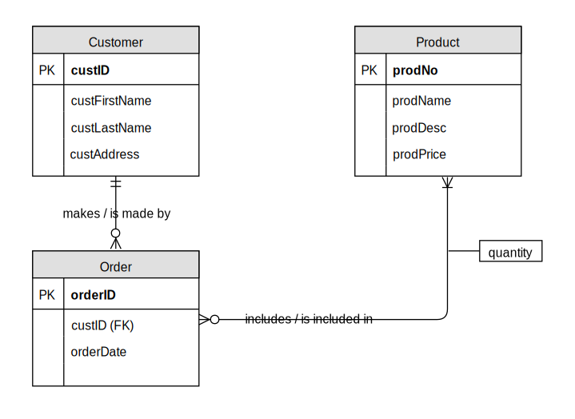

# 🗄 Week 03
### Data modelling
[©](https://creativecommons.org/licenses/by/4.0/) [Johnny Chan](mailto:jh.chan@auckland.ac.nz)

## 🕒 Previously ...
- Relational data model
	- relation, tuple, attribute, domain, schema, key, constraint

- SQL
	- CREATE TABLE, DROP TABLE, ALTER TABLE
	- Declaring constraints
	- INSERT, UPDATE, DELETE

- SQLite

## 📌 Agenda
- Data modelling

	- Entity-relationship (ER) modelling

	- ER diagram (ERD)

- Case study

## Data modelling
- Data modelling is the _process of creating a data model_ for a given set of data
	- conceptual → logical → physical

- How data are defined, structured and stored would have a _significant implication_ to how they can be accessed and manipulated

- 🤔 What makes a good data model?

- During the stage of physical data modelling it is often necessary to consider the data model’s impact on the efficiency of database operations

## ER model

- The concept is originally defined by [Chen (1976)](https://auckland.rl.talis.com/users/C899F913-6185-B4B9-3892-600310630A5F/bookmarks/946589C7-0C4F-4BD2-C58B-BB29DE416C29.html) which has been adopted and refined by practitioners as the leading method to carry out data modelling

- An ER model is a _systematic way_ of describing and defining a business process. The process is modelled as _entities_ that are linked with each other by _relationships_ that express the dependencies and requirements between them

- An ERD is used as a tool for ER modelling, which also provides a representation of the ER model

- 📚 Further: [ER model from Wikipedia](http://en.wikipedia.org/wiki/Entity%E2%80%93relationship_model)

## Entity
- An __entity__ is an object (abstract or physical)
	- "Interstellar", "Matthew McConaughey"
	- "University of Auckland", "OGG Building"

- Entities are grouped into __entity set__ or entity type / class
	- Movie, Actor
	- University, Building

- An entity set is conventionally named with a singular noun
	- related to business characteristics, meaningful and self-documenting; unique and concise, readable

- 📢 In ER modelling, sometimes an entity set is called an entity, whereas an entity is called an instance

## Relationship

- Two entity sets may be connected in some way. In the ER model this can be expressed as a __relationship__
	- The Movie and Actor entity sets are connected by actors starring in movies. For example, "Interstellar" is connected to "Matthew McConaughey"

- Degree
	- unary, binary, ternary, n-nary

- [Cardinality][c]
	- Multiplicity: one-to-one, one-to-many, many-to-many
	- Optionality: optional or mandatory

[c]: http://en.wikipedia.org/wiki/Cardinality_(data_modeling)

## Conceptual ERD

<small>Figure 3.1: Conceptual ER model of a product management system</small>

## Degree and cardinality

<small>Figure 3.2: Unary and binary relationships with different cardinalities</small>

## Multiple relationships

<small>Figure 3.3: Multiple relationships established among two entity sets</small>

## Attribute
- An __attribute__ is a property or a characteristic of an entity set (or a many-to-many relationship)
	- The entity set Actor might be given attributes name, address, gender and birthDate
	- Each entity in the entity set would have values associated with each attribute

- The value of attribute
	- atomic (single-valued) vs multivalued
	- stored vs derived

## Key
- In most cases, an entity can be uniquely identified in its entity set by the values of its attributes
	- A set of attributes whose values uniquely identify an entity in its entity set is called a __key__ or a __candidate key__
	- If there are several candidate keys, we choose one of them as the __primary key__, where its value must not change and must not be [null][n]

- Example: AUID could be chosen as the primary key for the Student entity set

[n]: https://en.wikipedia.org/wiki/Null_(SQL)

## ERD with attribute

<small>Figure 3.4: Conceptual ERD with attribute and key among entity sets and relationships</small>

# 💼 Case study
### An art museum <!-- .slide: data-background="art.jpg" data-background-transition="zoom" -->

## Objective
- Read the specification carefully, then:

	- draw a conceptual ERD to represent the given case study

	- extend the conceptual ERD with attribute

## Specification
- An art museum owns a large volume of works of art. Each work of art is identified by an item code. Each work can be described using a title, the size – composed of height, width and weight. A work of art is developed by an artist. The artist of some works is not known. An artist is identified by an artist number and described by name, age, gender, dob and dod (null for living artists!). Only data about artists for works currently owned by the museum are kept in the database

## More specification
- At any time, an art work is either displayed in the museum, held in storage, away from the museum as part of a travelling show, or on loan to another gallery. If on display the location of the display (in the museum) is noted. A travelling show is described by a show ID, city in which the show is currently appearing, and the start and end dates of the show. Many of the museum works can be part of a given show. One art work can be displayed in many shows over time. These need to be recorded for future analysis. A gallery is described by a gallery identifier, name and city. The museum wants to retain a history of all works of art loaned to another gallery. The date loaned and the date returned must be recorded and retained

## The modelling process
- Entity set
	- <!-- .element: class="fragment" -->
	Artwork (__itemCode__, title, height, width, weight)
	- <!-- .element: class="fragment" -->
	Artist (__artistNo__, name, gender, dob, dod)
	- <!-- .element: class="fragment" -->
	Show (__showID__, city, startDate, endDate)
	- <!-- .element: class="fragment" -->
	Gallery (__galleryID__, name, city)
	- <!-- .element: class="fragment" -->
	Location (__locID__, locDesc)

- Relationship
	- <!-- .element: class="fragment" -->
	Artist develops Artwork (optional one to mandatory many)
	- <!-- .element: class="fragment" -->
	Location displays Artwork (optional one to optional many)
	- <!-- .element: class="fragment" -->
	Show stores Artwork (optional many to mandatory many)
	- <!-- .element: class="fragment" -->
	Gallery borrows Artwork (optional many to mandatory many) with loanDate and returnDate

## Conceptual ERD

<small>Figure 3.5: Conceptual ERD of the art museum case</small>

## ERD with attribute

<small>Figure 3.6: Conceptual ERD with attribute for the art museum case</small>

## Conceptual to logical
- [Conceptual data model](https://en.wikipedia.org/wiki/Conceptual_schema)
	- a high-level description of the informational needs of a business
	- it describes the things of significance (entity sets), about which it is inclined to collect information, and characteristics of (attributes) and associations between pairs of those things of significance (relationships)

- [Logical data model](https://en.wikipedia.org/wiki/Logical_data_model)
	- a detailed representation of some or all of an organization's data, independent of any particular database management technology, and described in business language
	- the content is adjusted to achieve certain efficiencies

## Associative entity set
- In logical data modelling, one major task is to resolve __all__ many-to-many relationship in the conceptual data model by converting them to [__associative entity set__](https://en.wikipedia.org/wiki/Associative_entity)

- 🤔 Why is this step necessary?

- An associative entity set is used to represent a relationship which often has its own attribute that do not belong to other entity set

- Each many-to-many relationship would be resolved into two one-to-many relationships with an associative entity set

## Example

<small>Figure 3.7: Resolving a binary many-to-many relationship into an associative entity set</small>

## Another example

<small>Figure 3.8: Resolving an unary many-to-many relationship into an associative entity set</small>

## Quiz 01
- Draw a logical ERD to represent the following case

	- Each vendor can supply many parts to any number of warehouses but need not supply any parts
	- Each part can be supplied by any number of vendors to more than one warehouse, but each part must be supplied by at least one vendor to a warehouse
	- Each warehouse can be supplied with any number of parts from more than one vendor, but each warehouse must be supplied with at least one part

## Quiz 02
- Revisit the [art museum case study](#/4)

- Draw a logical ERD to represent the case study and list all assumptions made

## Quiz 03
- Modify the logical ERD of the [art museum case study](#/4) from [Quiz 02](#/7) to accommodate one additional requirement:

	- the museum would like to keep track of the history of displaying the works of art in different locations over time, with a start date and an end date recorded

## Existence dependency
- __Strong__ entity set
	- exists independent of other entity set
	- has its own unique identifier

- __Weak__ entity set
	- existence dependent on a strong entity set
	- does not have a unique identifier (only a partial identifier)

- The relationship between a strong entity set and a weak entity set is called an __identifying__ relationship, as opposed to __non-identifying__ relationship

## Strong and weak

<small>Figure 3.9: A strong entity set and a weak entity set with an identifying relationship</small>

## 🗒 Summary
- By now you should:

	- know the vocabulary of the ER model: entity, entity set, relationship, degree, cardinality, attribute, key etc

	- know how to create a data model with conceptual and logical ERD

	- have some fundamental knowledge of how to resolve many-to-many relationship with an associative entity set

	- understand the importance of assumption in ER modelling

	- understand the difference between strong and weak entity sets

## 📚 Reading
- Further
	- The ER model
		[Chen (1976): The Entity-Relationship Model - Toward a Unified View of Data](https://auckland.rl.talis.com/users/C899F913-6185-B4B9-3892-600310630A5F/bookmarks/946589C7-0C4F-4BD2-C58B-BB29DE416C29.html)

	- Crow's foot (Martin) notation
	 	[Steve (2002): The Details of Conceptual Modelling Notations are Important - A Comparison of Relationship Normative Language (p174-p176)](https://auckland.rl.talis.com/users/C899F913-6185-B4B9-3892-600310630A5F/bookmarks/EE015C6E-3615-408C-E481-01AF3E5E9BD5.html)

## 🗓 Schedule
Week | Lecture
--- | ---
01 | Introduction ✓
02 | Relational model ✓
03 | Data modelling ✓
04 | Data modelling
05 | Normalisation
06 | SQL
07 | SQL
08 | SQL
09 | SQL
10 | DBMS fundamentals
11 | Data warehouse
12 | Review and beyond

# 🌏 THE END
Don't forget database is awesome!

[🖨](?print-pdf)

## Enhanced ER modelling (bonus)
- These materials are optional and are for those who are interested in the [__enhanced ER modelling__](https://en.wikipedia.org/wiki/Enhanced_entity%E2%80%93relationship_model) techniques. They could be self-studied at your own pace, and are not required for any of the course assessments.

## Superset and subset
- Sometimes one entity set in an ER model is included in another one, i.e. all entities of one are also entities of another
	- the entity set Employee is included in the entity set Person
	- then Employee is the __subset__ (or subtype/subclass) and Person is the __superset__ (or supertype/superclass)

- Superset: a generic entity set that has a one-to-one relationship with one or more subsets

- Subset: a subgrouping of the entities in an entity set that has __distinct attributes and/or relationships__ among other subsets of the same superset

## Is-a relationship

<small>Figure 3.10: The Employee superset with its subsets and is-a relationships</small>

## Inheritance
- Attribute
	- A subset inherits all the attributes from the superset

- Relationship
	- Relationship defined at the superset level indicate that all subsets participate in that relationship as well

- 🤔 Which one is modelled with more details, the superset or the subset?

## Example

<small>Figure 3.11: The Patient superset and its subsets</small>

## Specialisation and generalisation
- Specialisation
	- The process of defining one or more subsets from the superset and establishing superset/subset relationships in a top down fashion

- Generalisation
	- The process of defining a more general entity set from a set of more specialised entity sets in a bottom-up fashion

## Specialisation

<small>Figure 3.12: Example of specialisation</small>

## Generalisation
- 🤔 Why does Motorcycle disappear from the generalisation?

<small>Figure 3.13: Example of generalisation</small>

## Completeness and disjointness
- Completeness specifies if an entity of a superset must also be an entity of at least one subset; it indicates if the specialisation is total or partial
	- Total specialisation : Yes | Partial specialisation : No

- Disjointness (or exclusiveness) specifies if an entity of a superset may simultaneously be an entity of two or more subsets
	- Disjoint (exclusive): No | Overlap (inclusive): Yes

## Total specialisation

<small>Figure 3.14: Example of total specialisation</small>

## Partial specialisation

<small>Figure 3.15: Example of partial specialisation</small>

## Disjoint

<small>Figure 3.16: Example of disjoint</small>

## Overlap

<small>Figure 3.17: Example of overlap</small>

## Discriminator
- Subset discriminator: an attribute of the superset whose values determine the target subset(s)
- 🤔 What happens when disjoint is replaced by overlap?

<small>Figure 3.18: Example of discriminator</small>

## Quiz 04

<small>Figure 3.19: A superset with 2 levels of subsets</small>

## Questions
1. Could a Person be both a Professional and an Undergrad?
2. Could a Person be both an Alumnus and an Employee, but neither an Academic nor a Professional?
3. Which attribute serves as the discriminator of Person?
4. For Undergrad with an accommodation, the location of that has to be recorded. Explain if any modification to the ERD is needed to achieve that
5. Student could have more than one majors in the undergraduate study. Explain the changes needed in the ERD
6. Suggest if there is an alternative way to model the discriminators of Employee and Student

## The concept of anybody

<small>Figure 3.20: The anybody structure</small>

# 💼 Case study
### Safari booking system <!-- .slide: data-background="safari.jpg" data-background-transition="zoom" -->

## Objective
- Read the specification carefully, then:

	- draw a logical ERD to represent the given case study, with the design principles in mind

	- apply the concepts from the Enhanced ER model when it is appropriate

	- state any assumption made

## Spec: Background
- Tane du Toit runs safaris in the middle of the North Island of New Zealand. His business is known as Mid-Island Safaris. Tane wishes to create a database to keep track of his customers – both prospective and those who have already booked for a safari. The database stores not only details of customers; it must record information about safaris, the safari trips, and bookings by customers for those safaris. A safari may be attempted only by people who are over the age of fourteen and under the age of seventy-five

## Spec: Customer
- A customer may not have booked for a safari, or may have booked and participated in many safaris. A company or an individual may be a customer – but only individuals are booked into scheduled safari trips. The data to be stored about a customer are as followed:

	- for a company: name, address (first line address, second line address, city, postal code, country) and contact name, email and phone number. A contact may change over time

	- for an individual: first name, last name, address (first line address, second line address, city, postal code, country), email, phone number and date of birth

## Spec: Preference
- A customer’s preferences for time slots during which they wish to travel must be retained in the database. A customer may be able to travel in several time slots during the year. Tane wishes to retain this information so that he can target only those able to participate with publicity for scheduled trips

## Spec: Safari
- A safari has: name, description, duration in days. A safari may be made up of other safaris. For example, the Great North Island Safari includes both the Thermal Area Safari and the East Coast Safari. A safari may be a component of many safaris and one safari may be made up of many safaris

- Usually each safari is scheduled for several time slots in a year. A safari trip is consisted of: date when trip starts, cost in NZ$ (once assigned, the cost will not be changed), maximum number of individuals, and the assigned guide

- A guide has: first name, last name, address (first line address, second line address, city, postal code, country), email, phone number and date of birth. A guide may be assigned to lead many trips over time

## Spec: Booking
- Any customer may make a booking. The date the booking was made must be retained. A booking may have one or many booking items, each item links to an individual who is being booked to a safari trip. The customer making the booking (and who is responsible for payment) may differ from the individuals booked within the items

- A booking is only accepted if accompanied by the full payment for all booking items

- A booking item (of which there may be one or more for a booking) must be for one individual in one safari trip. Thus, for one booking, there may be several items, each of which may be for different, or the same, safari trip

## Safari booking system

<small>Figure 3.21: The logical EERD of the Safari booking system</small>

# 💼 Case study
### Jump-a-lot gym database<!-- .slide: data-background="gym.jpg" data-background-transition="zoom" -->

## Background
- Theo Lee, the manager of the Jump-a-lot Gym, wishes to store the details of gym memberships and course payments in a database. You are required to design the logical data model that captures the information in preparation for implementing the application in a relational database. The data that Theo wishes to store are as follow

## Membership
- The gym sells two categories of membership:
  - an individual (i.e. for one person) category
  - an organisation category

- Each of those category must be one of four membership types:
  - one-month membership type
  - three-month membership type
  - six-month membership type
  - twelve-month membership type

## Purchase
- The purchase charge for a membership can differ for each membership type, for each category, and may change over time

- Individuals and organisations purchase a specific type of membership for their respective category

- The gym wishes to store the details about a person who purchases membership: member number, first name, family name, first line of address, second line of address, city, postcode, email address, preferred telephone contact number, date of birth, gender, description of any physical problems

- The data required for an organisation that buys a membership is: member number, organisation name, first line of address, second line of address, city, postcode, email address, preferred telephone contact number. An organisation membership simply allows employees of the organisation to use the gym

## Member
- The member number is a unique number that identifies the member, whether individual or organisation

- A member is an individual or an organisation that has purchased a type of membership. It is important to record when a membership is bought and the type of membership that is bought

- It is planned to retain in the database the details of people and organisations whose memberships have expired, but they must have purchased a membership at least once in order to obtain a member number

- A person or organisation will only become a member when the purchase price is paid. When a membership expires, a new membership must be purchased. Theo wishes to query the database to discover which memberships are close to expiry, so that reminder emails may be sent

## Class
- Only individual members may pay to attend aerobic classes. Classes are held weekly for a term. The details to be stored about an aerobic class are: class code, class description, duration of one class in hours, and the total number of weeks over which that class is held

- The individual is charged one amount for the whole term for the class and the charge may change over time. The enrolment will only be accepted with payment

## Stream
- There may be several streams of a particular class offered concurrently and over time. The details to be stored about a stream are: the stream number which is individual to the class, and the stream start date, and stream start time. Thus several classes may have a stream number one, for example

- Individuals enrol in a stream. The enrolment date needs to be retained in the database for the financial records as individuals must pay on enrolment

## Booking
- Organisations that are members can book the gym for the exclusive use of their staff. The time that may be booked by an organisation are to be stored in the database: day of the week, start time, duration

- The data to be retained about a booking are: unique booking number, date of booking, available time chosen

## Data modelling
- Draw a logical ERD in crow’s foot notation for the case

- Please note: all important design decisions and assumptions made must be clearly 	listed. All entity sets (with specialisation / generalisation as needed), all attributes including primary and foreign keys, and all relationships including cardinalities must be shown as appropriate. Following good database design principle, the ERD should not contain redundant entity sets, relationships or attributes

## Membership management system

<!-- .element: height="600px" -->

<small>Figure 3.22: The logical EERD of the membership management system</small>

## 🗒 Summary
- By now you should:

	- know the concepts in Enhanced ER model including superset and subset, specialisation and generalisation, and completeness, disjointness and discriminator

	- understand the concept of anybody

## 📚 Reading
- Further

	- [Elmasri et al., (1985): The Category Concept: An Extension to the Entity-Relationship Model](https://auckland.rl.talis.com/users/C899F913-6185-B4B9-3892-600310630A5F/bookmarks/3F9DB0D9-C1FC-7B56-37A9-818B634DAFA4.html)
