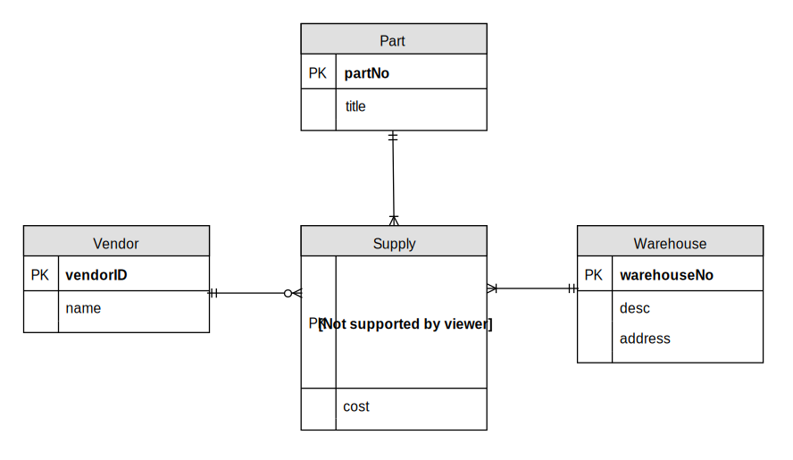
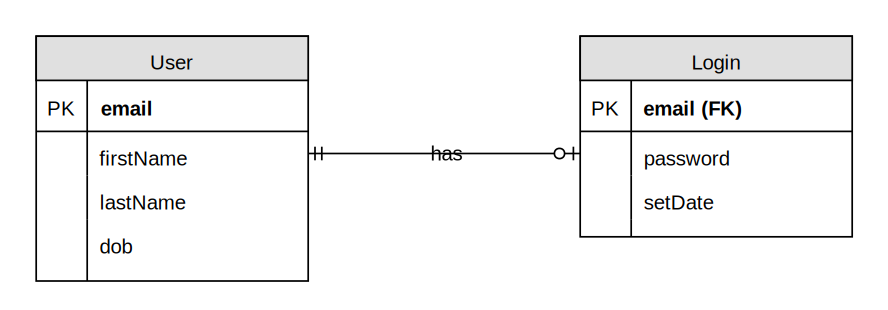
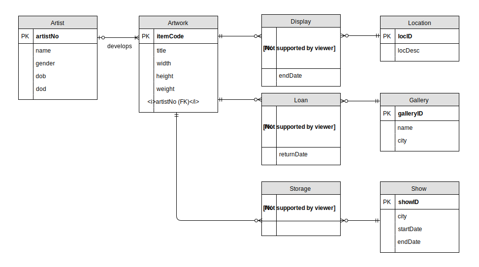
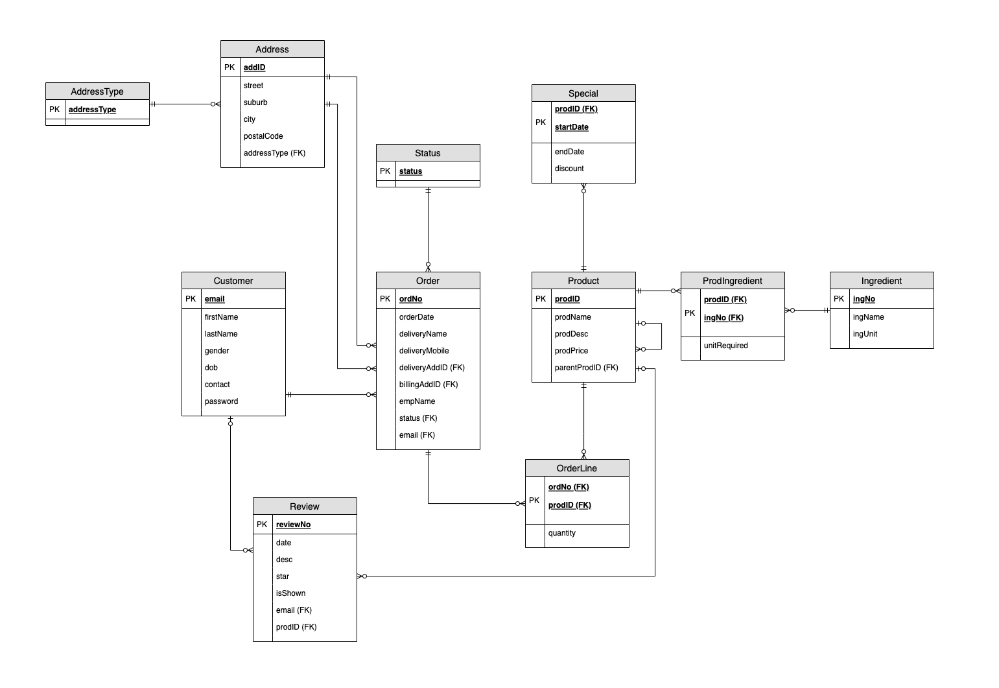
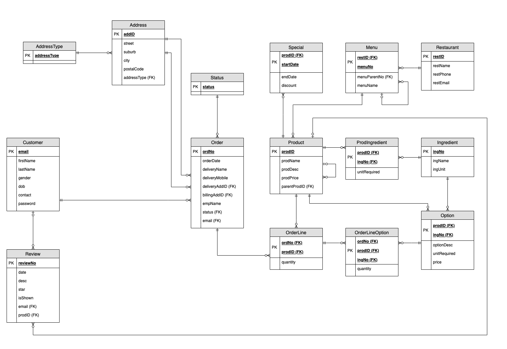
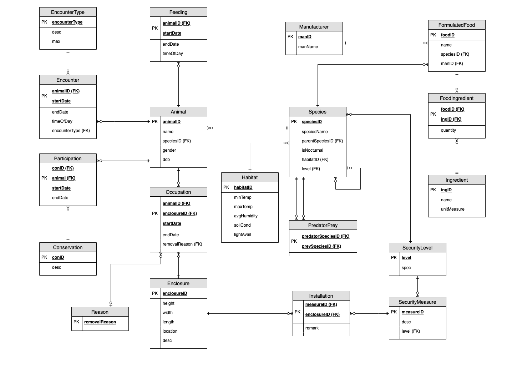

# 🗄 Week 04
### Data modelling
[©](https://creativecommons.org/licenses/by/4.0/) [Johnny Chan](mailto:jh.chan@auckland.ac.nz)

## 🕒 Previously ...
- ER model
	- entity, entity set, relationship, attribute and key
	- degree and cardinality of relationship
	- associative, strong and weak entity sets

- Data modelling
	- conceptual data modelling
	- logical data modelling

- ERD
	- crow's foot notation

- EER modelling (optional)

## 📌 Agenda
- Revisit some concepts

- Design principles for data modelling

- Case studies

## Revisit the models
ER model | Relational model | SQL
--- | --- | ---
entity set | relation | table
entity | tuple | row
attribute | attribute | column
key | key | key

## Foreign key
- In ER modelling, a [foreign key](http://en.wikipedia.org/wiki/Foreign_key) is defined for every relationship. For a typical one-to many, the foreign key stays with the child entity set on the many side, where it references the primary key of the parent/master entity set on the one side

- It is common to rename the foreign key in the child entity set, particularly in an unary relationship

- Allowing null or not for a foreign key specifies if the relationship is mandatory or optional

- If the foreign key becomes part of the primary key in the child entity set, that makes the entity set weak

- Foreign key = controlled data redundancy

## Referential integrity
- While primary key is an important element to uniquely identify each entity in a set, foreign key is a critical element for representing relationship

- It is the mean to protect [referential integrity](http://en.wikipedia.org/wiki/Referential_integrity)

- Referential actions (at the DBMS level)
	- Cascade update or delete
	- Restrict

## Strong vs weak

<small>Figure 4.1: An example of strong and weak entity sets</small>

- 🤔 Why do we care if entity sets are strong or weak?

- 🤔 What do we gain if we include that in the data model?

## Ternary relationship

<small>Figure 4.2: A resolved ternary many-to-many relationship among entity sets described in [Week 03 Quiz 01](../week03/#/6)</small>

## One-to-one relationship

<small>Figure 4.3: A binary one-to-one relationship</small>

- 🤔 Why is this not as common as one-to-many or many-to-many?

- 🤔 How should we deal with them?

## Design principle
- There are no right or wrong data model; just good or bad. Good data modelling is difficult; and the follow design principles could be useful:

	- be faithful to the specification of the requirement
	- use common sense and make assumption only if the specification fails to explain
	- avoid duplication and other redundant information
	- [KISS](https://en.wikipedia.org/wiki/KISS_principle) as much as possible

## Quiz 01
- How could this logical ERD be refined following the design principles?

<small>Figure 4.4: The logical ERD of the [art museum case study](../week03/#/8)</small>

# 💼 Case study
### Food delivery system <!-- .slide: data-background="pizza.jpg" data-background-transition="zoom" -->

## Objective
- Read the specification carefully, then:

	- draw a logical ERD to represent the given case study, with the design principles in mind

	- state any assumption made

## Spec: Background
- [Dante’s Pizzeria](https://static1.squarespace.com/static/5b4815892487fd35650c4a5f/t/62e9fea72cf76f3fba1dcc57/1659502254295/Dantes+Ponsonby+-+Food.pdf) in Ponsonby Central has decided to build a food delivery system to serve customer around the area. They need a database to keep track of their product, customer and order. After an interview with the owner, you have been given a list of requirement

## Spec: Product
- Each product of the company has a unique number, a name, a description and a price

- A product is made up of a number of ingredients. Each ingredient has a unique number, a name and a unit of measurement

- Occasionally, a product could be on special and the price would be discounted for a limited period of time. The system stores the history of product special, which includes a start date, an end date and the percentage of discount

## Spec: Customer
- A customer needs to register with an email address before they could use the delivery system. The system stores the first name, last name, gender, date of birth, contact number and password

- Each customer has a billing address and a delivery address, which could be the same or different. An address has a street, a suburb, a city, a postal code and an address type. An address type specifies if it is a residential or commercial address

## Spec: Order
- An order has a unique number, a timestamp, a delivery name, a delivery mobile and a status code. A status code describes the current status of the order. Each order is associated with a billing address and a delivery address. It is handled by an employee who delivers the product and collects the payment from the customer

- When a customer places an order, they could specify the quantity of each product they would like to order from the system. The company allows customer to choose the vegetarian version of some of the products without extra charge. For instance, fresh mozzarella could be swapped with vegetarian rennet for the Margherita pizza

## Spec: Feedback
- The company believes collecting feedback from customer is important, and they require the system to store review. A review is often made by a customer, but some from other media source may not have an author

- A review can be made directly to a particular product, or it could be associated with the company in general. Each review has a unique number, a date, a description, and a star number which ranges from one to five. The company could choose to show or not to show a review from the system

## 💬 Discussion
- In your logical ER model, specify which part must accompany with assumption in order to clearly articulate the rationale behind the design decision

- Suggest any alternative way of modelling any part of the case

- What design pattern have you discovered that could potentially be reused in other case?

## Food delivery system
<!-- .element: style="width:800px" -->

<small>Figure 4.5: The logical ERD of the food delivery system</small>

## Additional spec
- [Chop Chop Noodle House](https://ponsonbychopchop.co.nz/wp-content/uploads/2022/06/CHOP-CHOP-Menu-Web_230622-LoRes.pdf) in Ponsonby Central is interested in the system you are developing for Dante’s Pizzeria, and they are happy to pay an ongoing service fee to Dante’s Pizzeria if they could use the food delivery system to serve their customer. The owner of Dante’s Pizzeria thinks that is a brilliant idea - now a customer could order a variety of food product from more than one restaurants at a time

- After studying the website of Chop Chop Noodle House, list the new requirement and rule that must be followed for the food delivery system to accommodate two restaurants. Modify the logical ERD to reflect the changes required. Document and explain all the changes that have been made

## Food delivery system v2
<!-- .element: style="width:800px" -->

<small>Figure 4.6: The logical ERD of the food delivery system v2</small>

# 💼 Case study
### Animal management system <!-- .slide: data-background="animal.jpg" data-background-transition="zoom" -->

## Objective
- Read the specification carefully, then:

	- draw a logical ERD to represent the given case study, with the design principles in mind

	- apply common design pattern and modelling technique if appropriate

	- state any assumption made

## Spec: Background
- Waitomo Zoo, is a prospering zoo in the northern King Country region of Te Ika-a-Māui. It is home to an extensive array of animal species. Animal forms a core part of the enterprise dedicated to animal conservation and the education of people

- Currently the zoo uses a simple Excel spreadsheet for their internal record keeping, and that is no longer adequate. It has been proposed that the data would be transferred to a database system. However, before that could happen some issues need to be resolved. It is apparent that the zoo currently does not capture all the information it needs. The following outlines the requirements of the animal management system

## Spec: Animal
- Waitomo Zoo wants to capture the following data for each animal: the name, species, subspecies, gender, age, and whether or not they are nocturnal

- Each animal is fed once at a particular time in a day. Often an animal’s activity increases right before and during feeding; and when that happens visitor is more interested to view the animal. Thus it is required to store the current feeding time and maintain a record of previous feeding times

## Spec: Engagement
- Another way of engaging visitor with the animal is through a scheduled animal encounter. Some animals can be held, such as arachnid and small reptile; others are involved in shows e.g. seal and monkey. Some animals, such as elephant, are taken for walks around the zoo grounds

- Not all animals engage in animal encounter. If a specific animal is involved, the detail of encounter type should be recorded. The time in a day of an animal encounter is subject to change, and the zoo would like to keep a record of both the current time and previous times of animal counters among all animals

## Spec: Diet
- Different species have different dietary requirements; they are fed specially formulated foods which consist of many ingredients

- What each species is fed needs to be recorded accurately as the food is assembled offsite and delivered daily – the purpose of the record is to flag, for instance, a delivery arrives with a carton marked for zebras containing a meat based formulated food. The manufacturer of the formulated food is also recorded

## Spec: Habitat
- Waitomo Zoo prides itself on having species from all over the world, they arrange their exhibits so that species naturally located in the same habitat are in adjacent enclosures, or if possible share enclosures e.g. zebra and giraffe can share, whereas lion and gazelle cannot. The habitat of each species needs to be stored with minimum and maximum temperatures, average humidity, soil condition and light availability

## Spec: Enclosure
- Each enclosure is built according to certain dimensions. It is required to keep track of which enclosure each specific animal occupies over time. If for any reason a specific animal needs to be removed from an enclosure, e.g. aggressive behaviour towards cohabitants, this needs to be recorded

- It is critical to ensure an animal is not placed with any of their natural predator or prey

- An enclosure has security measures installed to prevent the occupant from escaping, and this is extremely important for lethal carnivores, animals prone to charging, and those with wings. Each security measure is classified by a security level. Animals should be placed in enclosure that match the required security level of their species (e.g. tiger = 5, penguin = 1)

## Spec: Conservation
- Finally, Waitomo Zoo is heavily involved in animal conservation, they participate in many global initiatives and themselves have created some conservation programmes. Many animals at the zoo participate in conservation programmes and the database stores the history of their participation

## Animal management system
<!-- .element: style="width:800px" -->

<small>Figure 4.7: The logical ERD of the animal management system</small>

## 🗒 Summary
- By now you should:

	- have deeper understanding of foreign key and referential integrity, strong/weak entity set, and relationship with different degree and cardinality

	- know the design principles behind data modelling, the importance of KISS, and how to apply them

	- understand and appreciate the importance of assumption

	- have practiced logical ER modelling and understood the process well

	- be confident in data modelling

## 📚 Reading

- No reading, just practice and practice!

## 🗓 Schedule
Week | Lecture
--- | ---
01 | Introduction ✓
02 | Relational model ✓
03 | Data modelling ✓
04 | Data modelling ✓
05 | Normalisation
06 | SQL
07 | SQL
08 | SQL
09 | SQL
10 | DBMS fundamentals
11 | Data warehouse
12 | Review and beyond

# 🌏 THE END
Don't forget database is awesome!

[🖨](?print-pdf)
