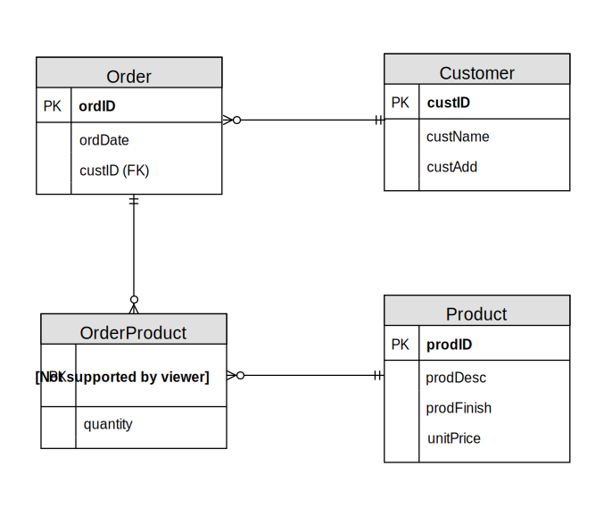
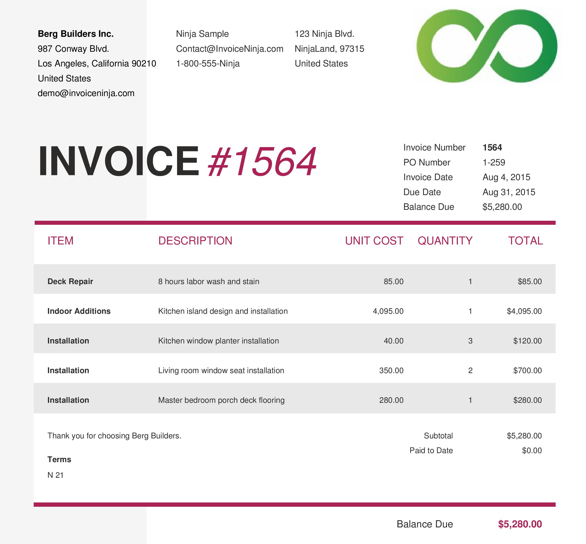
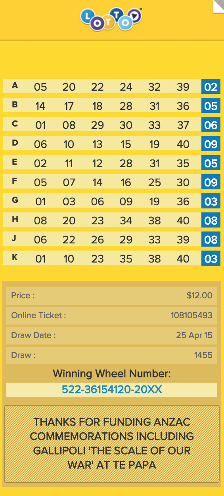
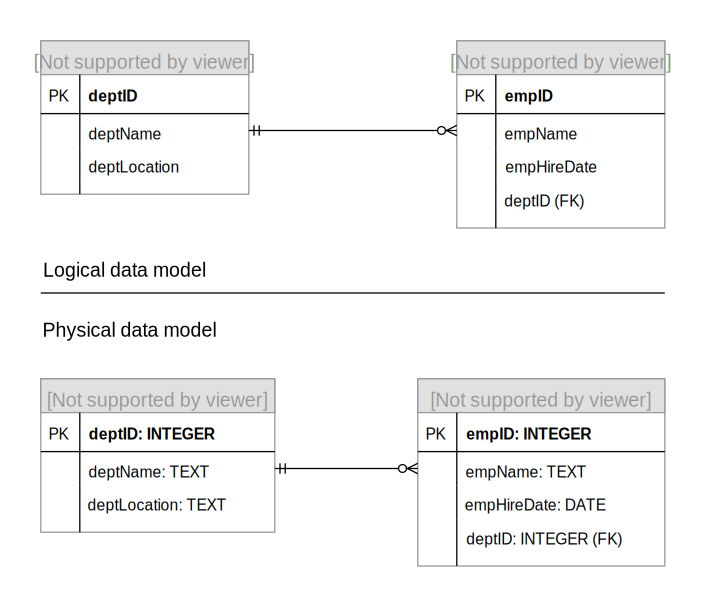

# 🗄 Week 05
### Normalisation
[©](https://creativecommons.org/licenses/by/4.0/) [Johnny Chan](mailto:jh.chan@auckland.ac.nz)

## 🕒 Previously ...
- Database, DBMS and relational model

- Basic SQL with SQLite
	- CREATE, INSERT, SELECT, UPDATE, DELETE

- ER modelling with crow's foot notation
	- conceptual data modelling
	- logical data modelling

- Case studies

## 📌 Agenda
- Normalisation

- Physical data modelling

## Normalisation
- According to [Wikipedia](https://en.wikipedia.org/wiki/Database_normalization):
	> The process of organizing attributes and relations of a relational database to minimize data redundancy through refactoring a relation into smaller ones without losing data

- A theoretical technique to refine and improve (or begin) logical data modelling

- But what is the problem with data redundancy?
	- data redundancy not only increases the storage need more than necessary; data structure that allows uncontrolled redundancy often invites unwanted anomalies <!-- .element: class="fragment" -->

## Anomaly
- Anomaly is inconvenient or error-prone situation arising when we interact with the relations. It could damage the integrity of data. There are three types of anomaly:

	- Insert anomaly
	- Update anomaly
	- Delete anomaly

## Insert anomaly
- It occurs when certain attribute values cannot be inserted to the relation without the presence of other attribute values. For example, we cannot add a new course COMPSCI220 unless we have at least one student enrolled in that course

stuNo | courseNo | stuName | stuAdd | courseDept
--- | --- | --- | --- | ---
1233321 | INFOSYS222 | Jones | Glendowie | ISOM
1233321 | MATHS108 | Jones | Glendowie | MATHS
9988765 | ACCTG101 | Smith | Ponsonby | ACCTG
4345000 | COMPSCI105 | Douglas | Papatoetoe | CS
4345000 | MATHS108 | Douglas | Papatoetoe | MATHS

## Update anomaly
- It exists when one or more instances of duplicated data is updated, but not all of them. For example, consider Jones is moving - changing the address of Jones from only one tuple introduces inconsistency to the data

stuNo | courseNo | stuName | stuAdd | courseDept
--- | --- | --- | --- | ---
1233321 | INFOSYS222 | Jones | Glendowie | ISOM
1233321 | MATHS108 | Jones | Glendowie | MATHS
9988765 | ACCTG101 | Smith | Ponsonby | ACCTG
4345000 | COMPSCI105 | Douglas | Papatoetoe | CS
4345000 | MATHS108 | Douglas | Papatoetoe | MATHS

## Delete anomaly
- It happens when some attribute values are lost because of the deletion of other attribute values. For example, consider if we delete all tuples with Douglas - information about the course COMPSCI105 would be lost too

stuNo | courseNo | stuName | stuAdd | courseDept
--- | --- | --- | --- | ---
1233321 | INFOSYS222 | Jones | Glendowie | ISOM
1233321 | MATHS108 | Jones | Glendowie | MATHS
9988765 | ACCTG101 | Smith | Ponsonby | ACCTG
4345000 | COMPSCI105 | Douglas | Papatoetoe | CS
4345000 | MATHS108 | Douglas | Papatoetoe | MATHS

## Normalisation steps
- First normal form (1NF)
	- To remove all multivalued attributes and to define a primary key for a given data structure

- Second normal form (2NF)
	- To remove all _partial_ functional dependencies that exist between a non-key attribute and part of a primary key for a given data structure with a composite key

- Third normal form (3NF)
	- To remove all _transitive_ functional dependencies that exist between a non-key attribute with another non-key attribute for a given data structure

## Example
ordID | ordDate | custID | custName | custAdd | prodID | prodDesc | prodFinish | unitPrice | quantity
--- | --- | --- | --- | --- | --- | --- | --- | --- | ---
1006 | 24/10/2015 | 2 | Value Furniture | Epsom | 7 | Dining Table | Natural Ash | 800.00 | 2
 | | | | | 5 | Writer's Desk | Cherry | 325.00 | 2
 | | | | | 4 | Entertainment Centre | Natural Maple | 650.00 | 1
1007 | 25/10/2015 | 6 | Furniture Gallery | Greenlane | 11 | Dresser | Oak | 500.00 | 4
 | | | | | 4 | Entertainment Centre | Natural Maple | 650.00 | 3

<!-- .element: class="smalltr" -->

## 1NF
To remove all multivalued attributes and to define a primary key

ordID (PK) | ordDate | custID | custName | custAdd | prodID (PK) | prodDesc | prodFinish | unitPrice | quantity
--- | --- | --- | --- | --- | --- | --- | --- | --- | ---
1006 | 24/10/2015 | 2 | Value Furniture | Epsom | 7 | Dining Table | Natural Ash | 800.00 | 2
1006 | 24/10/2015 | 2 | Value Furniture | Epsom | 5 | Writer's Desk | Cherry | 325.00 | 2
1006 | 24/10/2015 | 2 | Value Furniture | Epsom | 4 | Entertainment Centre | Natural Maple | 650.00 | 1
1007 | 25/10/2015 | 6 | Furniture Gallery | Greenlane | 11 | Dresser | Oak | 500.00 | 4
1007 | 25/10/2015 | 6 | Furniture Gallery | Greenlane | 4 | Entertainment Centre | Natural Maple | 650.00 | 3

<!-- .element: class="smalltr" -->

- Order(__ordID__, ordDate, custID, custName, custAdd, __prodID__, prodDesc, prodFinish, unitPrice, quantity)

- 📢 The primary key could also be indicated by a solid underline or (PK)

## 2NF
To remove all partial functional dependencies

- ordID → ordDate, custID, custName, custAdd
- prodID → prodDesc, prodFinish, unitPrice
- ordID, prodID → quantity

---

- Order(__ordID__, ordDate, custID, custName, custAdd)
- Product(__prodID__, prodDesc, prodFinish, unitPrice)
- OrderProduct(___ordID___, ___prodID___, quantity)

 

- 📢 The foreign key could also be indicated by a dash underline or (FK)

## 3NF
To remove all transitive functional dependencies

- custID → custName, custAdd

---

- Order(__ordID__, ordDate, _custID_)
- Customer(__custID__, custName, custAdd)
- Product(__prodID__, prodDesc, prodFinish, unitPrice)
- OrderProduct(___ordID___, ___prodID___, quantity)

## A normalised logical ERD

<small>Figure 5.1: A normalised logical ERD</small>

## Note
- If the given data structure in 1NF has a single attribute primary key, then there is no partial functional dependencies and hence the 1NF is in 2NF

- If the given data structure in 2NF has no transitive functional dependencies then it is in 3NF

- Derived attributes are not included (normally they are eliminated from 1NF to 2NF)

## The database oath
> Every non-key attribute must provide a fact about the key, the whole key, and nothing but the key, so help me Codd

- The key refers to 1NF
- The whole key refers to 2NF
- Nothing but the key refers to 3NF

## Quiz 01
- Derive a set of relations in third normal form (3NF) from the data given in the following slide. Show each step of normalisation clearly

- Draw a normalised logical ERD based on the result of normalisation

- 📢 Make sure the primary key and foreign key of relations are specified appropriately (either with underline or labelling)

## Invoice
[ <!-- .element: width="700px" height="650px" -->](invoice.png)

## Quiz 02
- Derive a set of relations in 3NF from the data given in the following slide. Show each step of normalisation clearly

- Draw a normalised logical ERD based on the result of normalisation

## Lotto ticket
[ <!-- .element: width="350px" height="650px" -->](lotto.png)

## Quiz 03
- Derive a set of relations in 3NF from the data given in the following slide. Show each step of normalisation clearly

- Draw a normalised logical ERD based on the result of normalisation

## Monopoly title
[ <!-- .element: height="650px" -->](monopoly.png)

## Physical data modelling
- A [physical data model](http://en.wikipedia.org/wiki/Physical_data_model) is a representation of data design which takes into account the facility and constraint of a given DBMS

- Practically speaking, a physical data model includes the domain / data type of the attribute defined in the logical data model, and sometimes constraint of entity set as well

- Physical data modelling is one step before implementing the relational DBMS with SQL

## Example

<small>Figure 5.2: Logical data model vs physical data model</small>

## Consideration
- Derived attribute
	- For the purpose of improving the performance of certain queries, it could be argued to store derived attribute to avoid the ad-hoc computation among large volume of data

- One-to-one relationship to decompose entity set
	- If there is reason beyond data modelling to physically separate some attributes from the same entity set into multiple entity sets (e.g. security), the physical data model should reflect that

- Denormalisation
	- It is not uncommon to reverse the process of normalisation to induce redundancy and eliminate the number of entity set for the purpose of performance and maintenance of the database

- 📢 Consideration must not be taken lightly without strong reasoning

## 🗒 Summary
- By now you should:

	- know the rationale behind normalisation

	- know how to apply the rules of 1NF, 2NF and 3NF

	- know how to draw a normalised logical ERD

	- understand physical data modelling and its consideration

## 📚 Reading

- Essential
	- [Normalisation from SQL for Web Nerds](http://philip.greenspun.com/sql/normalization)

- Further

	- A [tutorial](http://phlonx.com/resources/nf3/) on 1NF, 2NF and 3NF

## 🗓 Schedule
Week | Lecture
--- | ---
01 | Introduction ✓
02 | Relational model ✓
03 | Data modelling ✓
04 | Data modelling ✓
05 | Normalisation ✓
06 | SQL
07 | SQL
08 | SQL
09 | SQL
10 | DBMS fundamentals
11 | Data warehouse
12 | Review and beyond

# 🌏 THE END
Don't forget database is awesome!

[🖨](?print-pdf)
