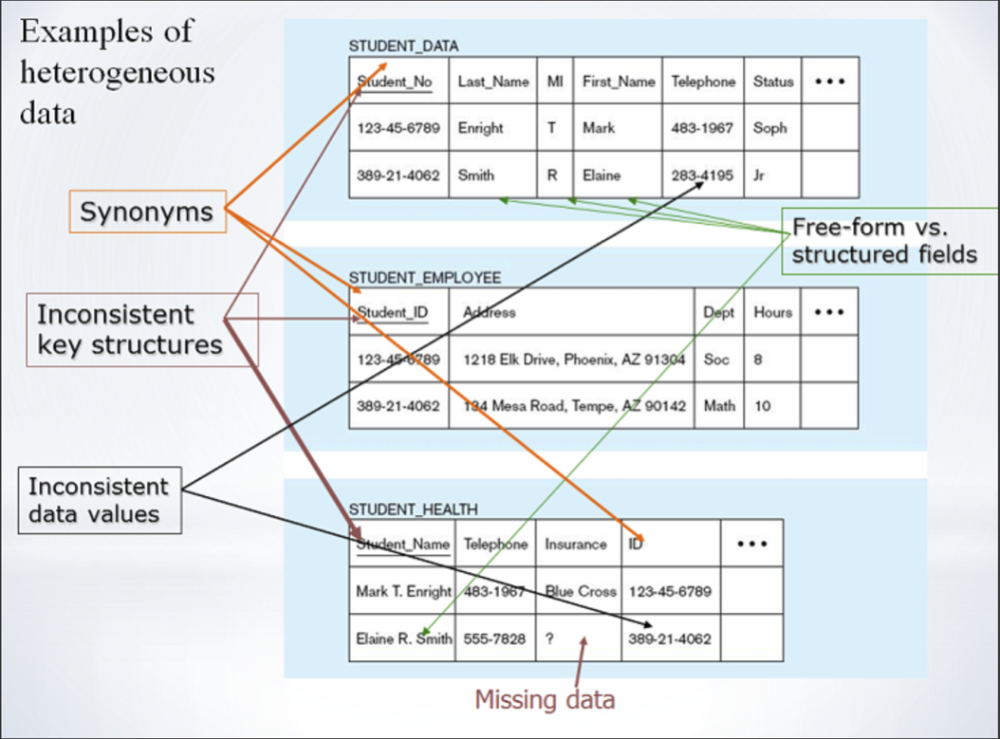
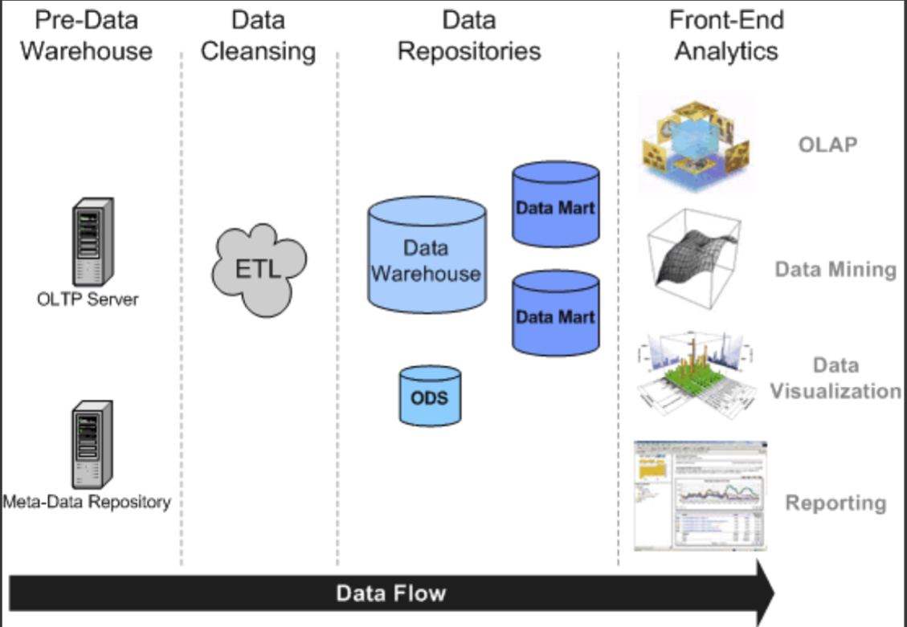
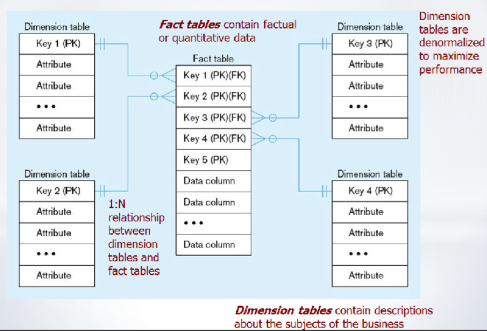
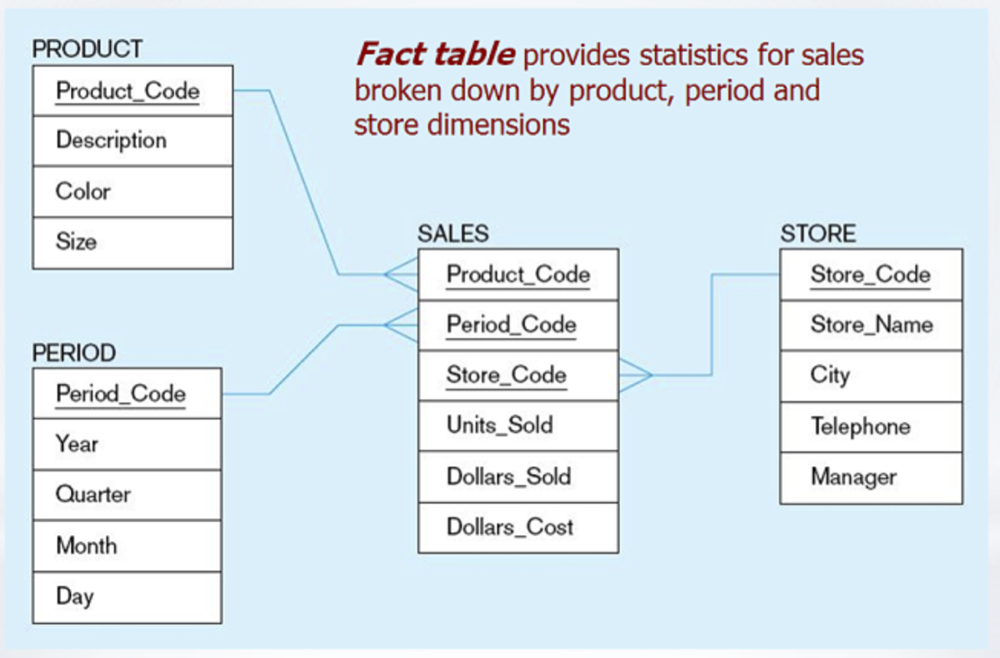
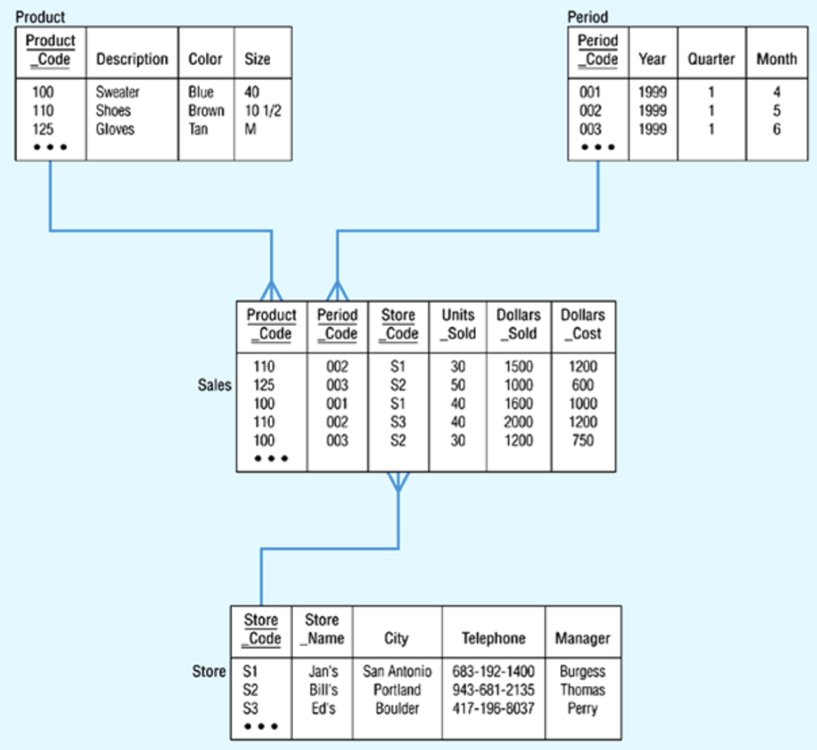
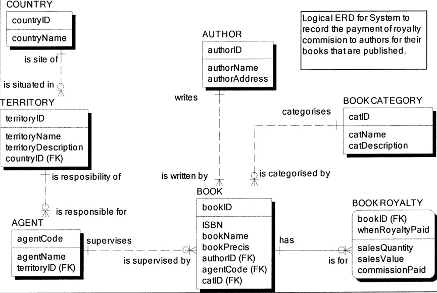

# 🗄 Week 11
### Data warehouse
[©](https://creativecommons.org/licenses/by/4.0/) [Johnny Chan](mailto:jh.chan@auckland.ac.nz)


## 🕒 Previously on ...

- Database efficiency

- Transaction management

- Concurrency control


## 📌 Agenda

- Data warehouse

- Star schema


## Data warehouse
- A [data warehouse](https://en.wikipedia.org/wiki/Data_warehouse) is a subject-oriented, integrated, time-variant, non-updatable collection of data used in support of management decision-making process

	- Subject-oriented: e.g. customer, patient, student, product
	- Integrated: consistent naming convention, format, encoding structure, multiple data source
	- Time-variant: support the study of trend and change
	- Non-updatable: read-only and periodically refreshed

- A [data mart](https://en.wikipedia.org/wiki/Data_mart) is a subset of a data warehouse that focuses on a specific business need


## Motivation
- Drowning in data but starved for information!

- Massive amount of data from business transaction
	- Most of them are unutilised or underutilised

- Improvement in IT
	- Database technology, hardware, middleware, user interface

- Intense competition for customer's attention


## Organisational trend
- No single system of record

- Multiple systems not being synchronised

- Organisational need to analyse activity in a balanced way

- Customer relationship management

- Supplier relationship management


## Example
 <!-- .element: height="600px" -->


## Creating a data warehouse
- Data Source
	- Internal and external

- Data Cleansing ([ETL](https://en.wikipedia.org/wiki/Extract,_transform,_load))
	- Data extraction
	- Data transformation
	- Data loading

- Data Repository
	- Data warehouse
	- Data mart


## Data flow
 <!-- .element: height="600px" -->


## Designing the data warehouse
- Star schema
	- Fact
	- Dimension
	- Attribute
	- Attribute hierarchy


## Star schema
 <!-- .element: height="600px" -->


## Fact and dimension
- Fact is a numeric measurement or value that represents a specific business aspect or activity

- Dimension qualifies characteristic that provides additional perspective to a given fact

- Fact and dimension tables are normally represented by physical tables in the data warehouse

- Fact table has many-to-one relationship to each dimension and subject to primary key and foreign key constraints


## Example
 <!-- .element: height="600px" -->


## Example
 <!-- .element: height="600px" -->


## Database vs data warehouse

- Database
	- Time span: represents current transaction
	- Granularity: represents specific transaction thats occur at a given time
	- Dimensionality: focuses on representing atomic transaction

- Data Warehouse
	- Time span: tends to cover long time frame
	- Granularity: presents at different levels of aggregation
	- Dimensionality: could be analysed from multiple dimensions


## Size of fact table

```txt
Total number of stores = 1000
Total number of products = 10000
Total number of periods = 24 (2 years worth of data)

If on average, 50% of products are sold in any given month:

Total number of rows = 1000 * 5000 * 24 = 120000000
```


## Quiz 01
- In a conversation with the general manager of Johnson and Johnson NZ, he would like you to be involved in their data warehouse project. He describes to you that the basic requirement for the data warehouse is to be able to project the sales of their products to specific customers through a particular channel. And that projection should be based on historical data of the sales

- Draw a simple star schema (with fact and dimension) that captures the requirement of the data warehouse


## Quiz 02
- Draw a star schema based on the following spec:
	- Product (__ProductID__, ProductCode, ProductName, _SubCategory_, Brand, Height, Width)
	- Category (__Category__)
	- SubCategory (__SubCategory__, _Category_)
	- Store (__StoreID__, StoreName, ParentChain, Region, Territory, Zone, Address, City, State, Zip)
	- Sale (___StoreID___, ___ProductID___, __SaleTimestamp__, SaleDollar)
	- 10 years of data with 200 stores and 3000 products on average every single day

- What would be the estimated size of the fact table?


# 💼 Case study
### Book publisher data mart<!-- .slide: data-background="book.png" data-background-transition="zoom" -->


## Background
- Best Book Publisher (BBP) has a business policy to only publish books written by a single author. BBP assigns its agents to supervise the publishing of each book written by an author who resides in the agent's territory


## Database



## Specification
- BBP would like to store all the data related to their book transactions in a data warehouse. In order to test the data warehouse technology, BBP will experiment with a pilot data mart that will source its data only from the data modelled in the ERD. BBP wishes to organise the data extracted from the entity sets in the ERD into a data cube so as to facilitate the answering of queries that support decision making

- The pilot data mart will be used to investigate the facts about the quantities of book sold, the value of those sales, and the royalty commissions paid to individual author for that book. BBP would like the grain for time to be one month


## Objective
- Choose the dimensions from those available in the ERD and draw a star schema for the required data mart

- BBP wishes to retain three years of data in the data mart. BBP has a total of 30 sales territories spread over three countries. Each territory has, on average, five agents; and agents are responsible for, on average, in any one month, 20 books each. How many rows, on average, will be retained in the fact table of the data mart?


## 🗒 Summary
- By now you have learnt:

	- the purpose and nature of data warehouse, and how it is different from a database

	- how to design a datawarehouse using star schema


## 📚 Reading

- Essential
	- [An Overview of Data Warehousing and OLAP Technology](https://auckland.rl.talis.com/users/C899F913-6185-B4B9-3892-600310630A5F/bookmarks/8AC175FB-3E72-3C77-3F6F-EF094E047E8C.html)


## 🗓 Schedule
Week | Lecture
--- | ---
01 | Introduction ✓
02 | Relational model ✓
03 | Data modelling ✓
04 | Data modelling ✓
05 | Normalisation ✓
06 | SQL ✓
07 | SQL ✓
08 | SQL ✓
09 | SQL ✓
10 | DBMS fundamentals ✓
11 | Data warehouse ✓
12 | Review and beyond


# 🌏 THE END
Don't forget database is awesome!

[🖨](?print-pdf)
