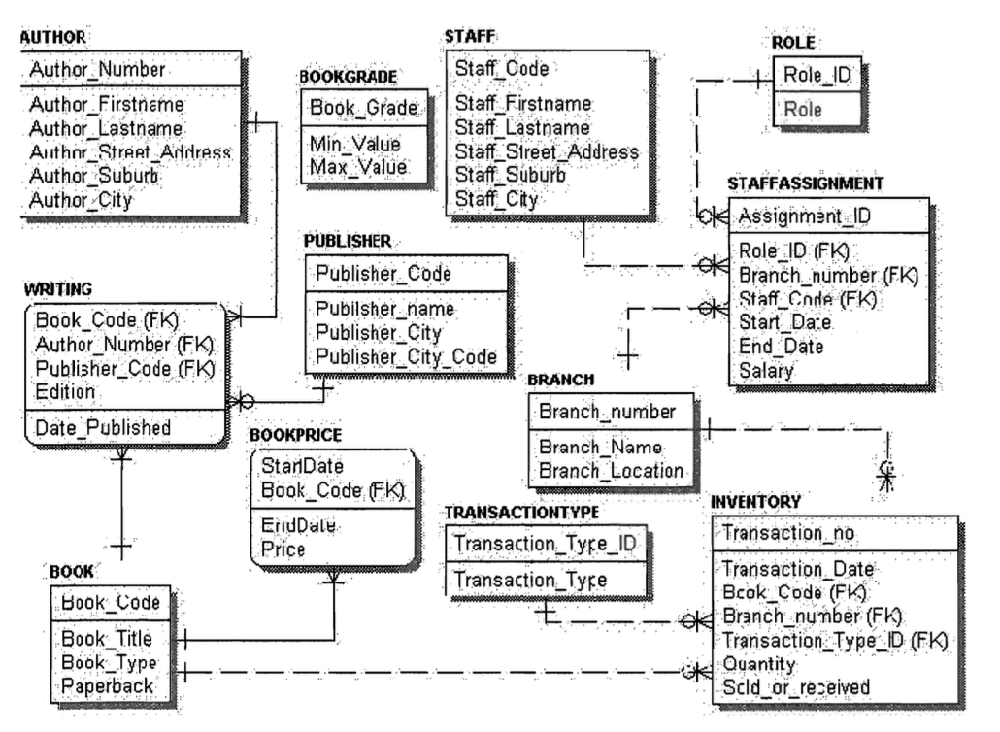
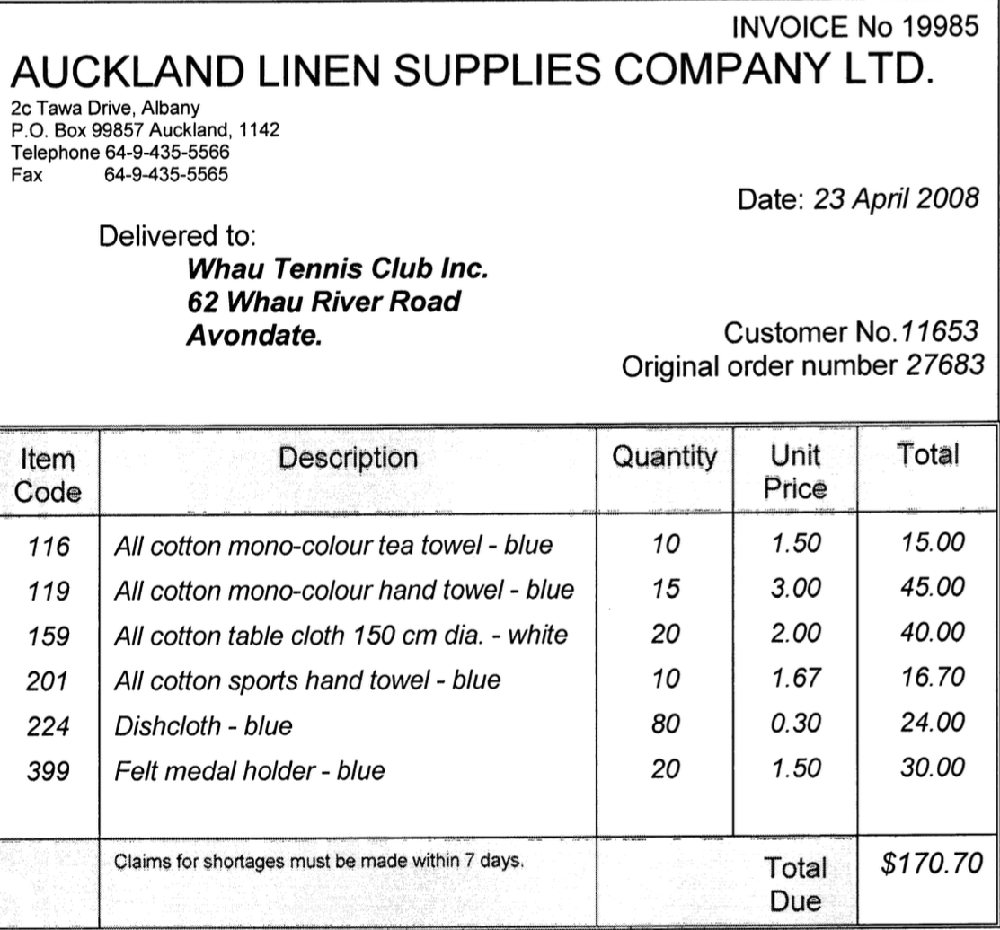
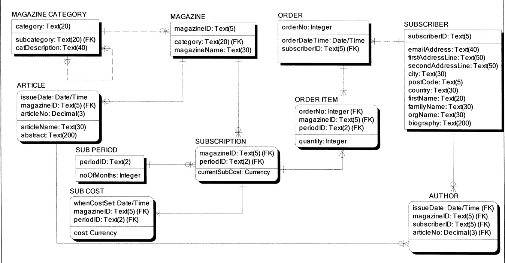

# 🗄 Week 12
### Review and beyond
[©](https://creativecommons.org/licenses/by/4.0/) [Johnny Chan](mailto:jh.chan@auckland.ac.nz)


## 🕒 Previously ...

- Data warehouse

- Star schema


## 📌 Agenda

- Case studies

- Course review

- Beyond RDBMS


# 💼 Case study
### Fisheries corporation<!-- .slide: data-background="fishery.jpg" data-background-transition="zoom" -->


## Background
- The Fisheries Corporation has decided to store information regarding fishing vessels as well as catches (of fish) in a database. The database will also hold other organisational data. The case study given is not comprehensive and has been adapted to keep within the scope of the examination


## Company
- Many companies may be formed under a single parent company. When a company lists within the Fisheries Corporation, the company is given a registration number. The company address and contact numbers are also recorded with the Fisheries Corporation. the address and contact details may change over time


## Vessel
- Each vessel has an FVN (fishing vessel number), a date of construction, a size (meters) and displacement (tonnes). Each vessel also has a fishing configuration (e.g. long-line, trawl, seine, and jig), which may change over time. Each fishing vessel is given a vessel name

- Each vessel must be registered to a single company at any point in time. However, over a period of time a vessel may be registered to many companies. Each company may have multiple vessels registered at any point in time


## Area
- Each fishing vessel is assigned to a fishing area. A vessel may only be assigned to a single area at any point in time, but over a period of time it may be assigned to any number of areas. Each fishing area has an area identifier, and a total allowable catch quota (TAC) for each fish species that live in the area. Note that this TAC quota is updated on a yearly basis

- Each fish species recorded by the Fisheries Corporation has a species code, a common name and a scientific name


## Quota
- In order to commercially fish, a quota must be purchased from the Fisheries Corporation. Each quota is designated by a fishing quota number (FQN), and specifies the area, the species, and the quantity that a company may fish. A quota is for a fixed period of time. Each quota specifies a single species and a single area

- For each fishing assignment, a vessel has a number of catches recorded against it. The information recorded about a catch includes the exact location (longitude and latitude), the depth, the sea temperature, and when the catch was taken. Each species may be caught in one or more catches, and a catch may contain a number of different species of fish. For each species in the catch the quantity (tonnes) is recorded


## Data modelling
- Draw a logical ERD in crow’s foot notation for the case

- Please note: all important design decisions and assumptions made must be clearly 	listed. All entity sets (with specialisation / generalisation as needed), all attributes including primary and foreign keys, and all relationships including cardinalities must be shown as appropriate. Following good database design principle, the ERD should not contain redundant entity sets, relationships or attributes


## Does this solution satisfy the case?

<!-- .element: height="600px" -->


## Normalisation
- The Senior Members Fishing Association wishes to keep track of its members, their type of membership, and who attended the Association's Annual General Meetings (AGM). The Association has created one table to store all this information as shown below

```
AGM_ATTENDANCE(AGMDate, memberNo, memberName,
membershipType, membershipTypeDescription,
comments_made_at_AGM)
```

- Derive a set of relations in third normal form (3NF) from the given table. Show each step of normalisation clearly. Indicate primary keys and foreign keys with solid / dashed lines or labels. State your assumptions clearly in your answer


## Data warehouse
- It is identified that a data warehouse will be useful to analyse the information held in the Fisheries Corporation's database

- The Fisheries Corporation wishes to analyse data monthly about the fish species caught in each fishing area, on different vessels over a period of three years. They would also like to find out which companies caught which species of fish in which area

- Draw a star schema for the required data mart


# 💼 Case study
### Book database<!-- .slide: data-background="book.jpg" data-background-transition="zoom" -->


## Specification

<!-- .element: height="600px" -->


## Question 01
- Write an SQL statement to create the table WRITING


## Question 02
- Write an SQL statement to list all staff who do not live in Auckland. The output should be displayed to show the Staff_Code in one column and the Staff_Firstname and Staff_Lastname as staffname in another column


## Question 03
- A customer calls in at the bookshop to inquire who the author is of a particular book. Unfortunately he cannot remember the whole title and gives the following string - 'One flew'. Write a SQL query to list all the books that have this string as part of the book title


## Question 04
- The Inventory manager of the book store wants you to list all the book titles and the total quantity received for each book. Make sure all books that do not have a quantity received are also listed


## Question 05
- List the current quantity of books available for each title. Assume that this can be calculated by first working out the total quantity received for each book as well as the total quantity of each book sold. You may use one or more views or sub-queries as needed


# 💼 Case study
### Auckland linen supplies<!-- .slide: data-background="linen.jpg" data-background-transition="zoom" -->


## Specification

<!-- .element: height="600px" -->


## Normalisation
- Derive a set of relations in third normal form (3NF) from the given table. Show each step of normalisation clearly. Indicate primary keys and foreign keys with solid / dashed lines or labels. State your assumptions clearly in your answer


# 💼 Case study
### Magazine subscription system<!-- .slide: data-background="magazine.jpg" data-background-transition="zoom" -->


## Specification



## Question 01
- Write a SQL statement to create the table SUB COST which stores the history of the costs of subscriptions for a magazine for specific periods (number of months). Assume that all related tables have already been created. The maximum cost for a subscription will be $400.00


## Question 02
- Write a SQL statement to find the original cost of a subscription for six months (periodID = '06'), to the magazine with the magazineID of '12345'


## Question 03
- Write a SQL statement to list the names of all articles that have been printed in magazine issues between and including the dates of 2008-01-01 and now, with their authors names. Authors names should be displayed under a column heading of "Author" and should be in the form of family name, initial (first character) of first name (e.g. Costain, G). Ensure that all articles are included in the list, including those that do not have authors. Note: Authors are always persons


## Question 04
- Write a SQL statement to display the order number, the subscriber first name and family name, the organisation name, and the total cost of all order items for order number 12234


## Question 05
- Subscribers may be people or organisations. An organisation's name is stored in the attribute orgName in the table SUBSCRIBER. Write a SQL statement to create a view of all subscribers who are organisations. Use a relational operator to list all subscribers who are not organisations (i.e. have no organisation name)


## Course review
Week | Content
--- | ---
01 | Introduction ✓
02 | Relational model ✓
03 | Data modelling ✓
04 | Data modelling ✓
05 | Normalisation ✓
06 | SQL ✓
07 | SQL ✓
08 | SQL ✓
09 | SQL ✓
10 | DBMS fundamentals ✓
11 | Data warehouse ✓
12 | Review and beyond ✓


## Beyond RDBMS
- A NoSQL database provides a mechanism for storage and retrieval of data which is modelled in means other than tabular relations used in relational databases

- A NoSQL database may choose to trade consistency for availability and performance
  - lack of true ACID transaction
  - provide "eventual consistency"
  - suffer from lost update and dirty read
  - support real-time analytics on huge amount of data

- [MongoDB](https://www.mongodb.com/)
  - document-based (JSON)
  - open source
  - adapted by Adobe, eBay, FIFA (video game), Foursquare, LinkedIn, McAfee, CERN


# THE END
Don't forget database is awesome!

[🖨](?print-pdf)
